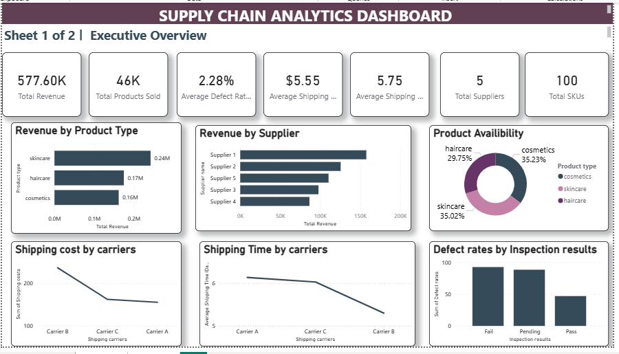
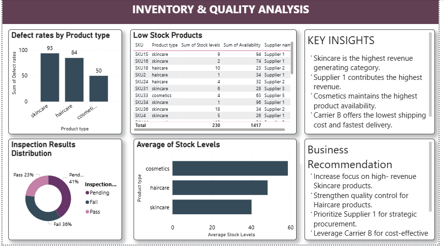

#Supply Chain Analytics Dashboard
## Project Overview
This project analyzes supply chain operations using Python, SQL and Power BI.
The objective is to identify revenue trends, supplier performance, inventory risks, logistics efficiency, and product quality issues.
The dashboard provides actionable business insights and recommendations for supply chain optimizations.
## Tools & Technologies
- Python (Pandas, Matplotlib, Seaborn)
- MySQL
- Power BI
- Jupyter Notebook
- Github
## Dataset
Dataset : Supply Chain Analysis Dataset
Rows : 100
Column : 24
Key Fields:
- Product Type
- SKU
- Supplier Name
- Shipping Costs
- Shipping Times
- Stock Levels
- Defect Rates
- Inspection Results
## Python Analysis
Performed
- Data Inspection
- Data Cleaning Validation
- KPI Analysis
- Supplier Analysis
- Product Analysis
- Logistics Analysis
- Inventory Analysis
- Correlation Analysis
- Visualizations
## SQL Analysis
Performed:
- Revenue Analysis
- Product Analysis
- Supplier Analysis
- Inventory Analysis
- Logistics Analysis
- Quality Analysis
- Window Analysis
- Ranking Analysis
## Power BI Dashboard
Page 1: Executive Dashboard
- Total Revenue
- Total Products Sold
- Average Defect Rate
- Average Shipping Cost
- Average Shipping Time
- Revenue by Product type
- Revenue by Supplier
- Product Availability
- Logistics Analysis
Page 2: Inventory & Quality Analysis
- Defect Rate by Product Type
- Inspection Results Distribution
- Low Stock Products
- Average Stock Levels
- Key Insights
- Business Recommendations
## Key Insights
- Skincare generates the highest revenue.
- Supplier 1 contributes the highest revenue.
- Cosmetics has the highest product availability.
- Carrier B provides the lowest shipping cost and fastest delivery.
- Haircare products show higher defect rates.
## Business Recommendations
- Increase focus on high-revenue skincare products.
- Improve quality control for haircare products.
- Strengthen relationships with top-performing suppliers.
- Use Carrier B for cost-efficient logistics.
- Monitor low-stock products to avoid stockouts.
## Dashboard Preview
### Executive Overview

### Inventory & Quality Analysis

